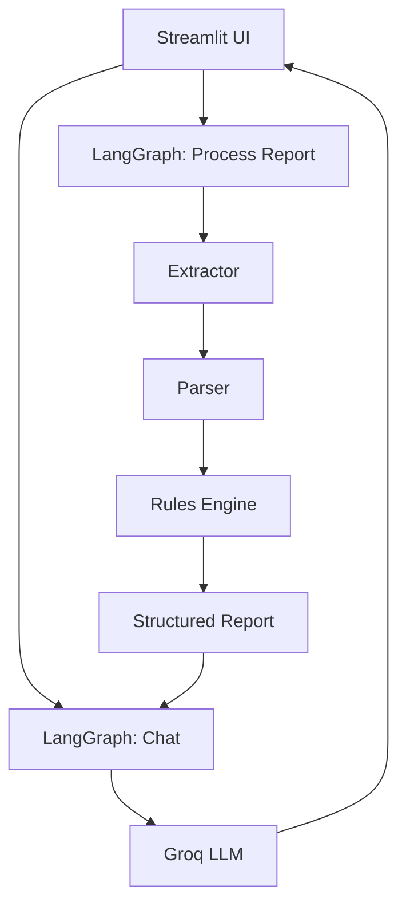
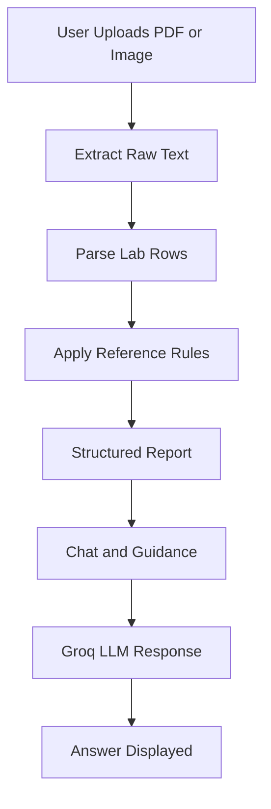
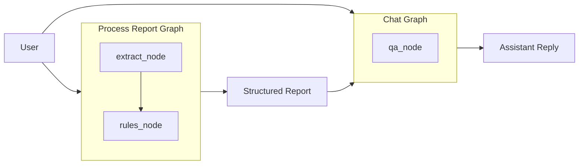

# Medical Lab Report Chatbot

Explain lab reports clearly, safely, and fast.

This repository contains a Streamlit application that ingests lab reports, turns them into structured data, and produces plain-language explanations with non-diagnostic guidance. The system is designed for clarity, safety, and privacy, with all data living in session state only.

---

## Table of Contents

1. What This Project Is
2. Our Aim
3. What We Provide
4. Core Tech Stack
5. The Power of Agentic AI and LangGraph
6. System Architecture
7. Project Flow
8. Core Files in Sequence
9. Core File Reference
10. Data Flow Deep Dive
11. LLM Prompting Strategy
12. Safety and Privacy
13. Setup and Configuration
14. Usage
15. Observability and Logging
16. Performance Notes
17. Extensibility
18. Troubleshooting
19. Demo Data
20. Roadmap
21. FAQ
22. License

---

## What This Project Is

This is a lab-report understanding assistant with two explicit layers:

1. A deterministic processing layer that extracts text, parses values, and applies reference range rules.
2. A reasoning layer that turns the structured report into clear explanations and helpful, non-diagnostic guidance.

The combination provides trustworthy explanations while keeping the model grounded in structured data.

---

## Our Aim

1. Make lab reports understandable without medical training.
2. Provide consistent, structured explanations that do not invent values.
3. Offer non-diagnostic guidance to support better questions for clinicians.
4. Keep user data private by avoiding storage.

---

## What We Provide

1. PDF and image ingestion with OCR fallback for scanned reports.
2. Parsing into structured lab rows with reference ranges.
3. Rules-based labeling of normal, high, low, and critical results.
4. Clear, plain-language summaries and explanations.
5. Non-diagnostic diet guidance that respects user context.
6. A Type 1 vs Type 2 likelihood note based on optional inputs.

---

## Core Tech Stack

| Area | Technology |
| --- | --- |
| UI | Streamlit |
| LLM | Groq client + Llama 3.3 70B |
| Orchestration | LangGraph |
| Parsing | Python regex + custom rules |
| PDF | PyMuPDF |
| OCR | Tesseract via pytesseract + Pillow |
| Images | Pillow |
| Logging | Python logging |
| Config | python-dotenv |

---

## The Power of Agentic AI and LangGraph

This project shows the power of agentic AI and LangGraph when combined with deterministic processing.

Agentic AI means the system is guided by explicit steps rather than a single, unstructured prompt. LangGraph enforces those steps with a graph of nodes and predictable state flow.

Key benefits in this system:

1. The processing graph never calls the LLM and remains fully deterministic.
2. The chat graph calls the LLM only after the structured report is ready.
3. The model is grounded in verified data rather than raw, noisy text.
4. The workflow is debuggable, testable, and safe to extend.

---

## System Architecture

High-level components:



---

## Project Flow

End-to-end flow from upload to answer:



LangGraph flow:



---

## Core Files in Sequence

Execution sequence during typical use:

1. `app.py`
2. `config_logging.py`
3. `reasoning/graph.py`
4. `document_processing/extractor.py`
5. `document_processing/parser.py`
6. `reasoning/rules.py`
7. `reasoning/llm.py`
8. `reasoning/__init__.py`

Upload and processing sequence:

1. `app.py`
2. `reasoning/graph.py`
3. `document_processing/extractor.py`
4. `document_processing/parser.py`
5. `reasoning/rules.py`

Chat sequence:

1. `app.py`
2. `reasoning/graph.py`
3. `reasoning/llm.py`

---

## Core File Reference

| File | Role |
| --- | --- |
| `app.py` | Streamlit UI, session state, and orchestration |
| `config_logging.py` | Central logging configuration |
| `document_processing/extractor.py` | PDF and image text extraction |
| `document_processing/parser.py` | Parse text into structured lab rows |
| `reasoning/rules.py` | Reference range rules engine |
| `reasoning/llm.py` | Groq LLM integration and prompt building |
| `reasoning/graph.py` | LangGraph pipelines |
| `reasoning/__init__.py` | Public exports for reasoning package |

---

## Data Flow Deep Dive

### 1) Initialization

1. `app.py` loads `.env` and configures logging.
2. Streamlit initializes session state.
3. The UI is rendered and awaits user input.

### 2) Report Processing

1. A user uploads a PDF or image.
2. The process-report graph runs in `reasoning/graph.py`.
3. `document_processing/extractor.py` extracts raw text.
4. `document_processing/parser.py` parses values and ranges.
5. `reasoning/rules.py` computes status and facts.
6. `app.py` stores the structured report in session state.

### 3) Chat and Explanation

1. A user enters a question in the chat.
2. The chat graph runs in `reasoning/graph.py`.
3. `reasoning/llm.py` builds a strict system message.
4. Groq returns the response.
5. `app.py` renders the answer and updates history.

### 4) Diet Guidance

1. `app.py` calls `get_diet_guidance` when needed.
2. `reasoning/llm.py` requests strict JSON output.
3. Parsed JSON is displayed in the UI.
4. If JSON fails, a deterministic fallback is used.

---

## LLM Prompting Strategy

1. The system prompt contains the full structured report.
2. The model is told to avoid inventing values.
3. The response format is structured and consistent.
4. Diet guidance is returned as strict JSON for reliable rendering.

---

## Safety and Privacy

Safety principles:

1. The model only sees structured data from the parser and rules engine.
2. Abnormal results trigger clear clinician follow-up guidance.
3. Responses are non-diagnostic and educational.
4. A disclaimer is shown throughout the UI.

Privacy principles:

1. No database is used.
2. No reports are stored on disk.
3. All data remains in Streamlit session state.
4. Closing the session clears all data.

---

## Setup and Configuration

Setup steps:

1. Create and activate a virtual environment.
2. Install dependencies.
3. Create a `.env` file with Groq credentials.

```bash
python -m venv .venv
.venv\Scripts\activate
pip install -r requirements.txt
```

Create `.env`:

```bash
GROQ_API_KEY=your_groq_api_key_here
GROQ_MODEL=llama-3.3-70b-versatile
```

---

## Run

```bash
streamlit run app.py
```

The terminal will show a local URL, typically `http://localhost:8501`.

---

## Usage

1. Upload a lab report in PDF or image format.
2. Wait for the processing message.
3. Review the summary and critical findings.
4. Ask questions in the chat.
5. Review diet guidance and Type likelihood notes as needed.

---

## Optional Context Inputs

These inputs refine the likelihood note and diet guidance:

1. Age at onset
2. BMI
3. Body habitus
4. Speed of onset
5. Ketosis or DKA history
6. Insulin required right after diagnosis
7. Family history
8. Signs of insulin resistance

---

## Observability and Logging

The app logs the following:

1. File size and extraction method.
2. Parsed row counts.
3. Rule outcomes and critical flags.
4. LLM call metadata.
5. JSON parse failures and fallback activation.

---

## Performance Notes

1. OCR can be slower for large scans.
2. LLM calls dominate latency for chat responses.
3. The pipeline favors correctness and clarity over raw speed.

---

## Extensibility

Ideas for next steps:

1. Add lab-specific explanations in `reasoning/llm.py`.
2. Expand rules coverage in `reasoning/rules.py`.
3. Add trend analysis for multiple reports.
4. Add more LangGraph nodes for specialized tasks.

---

## Troubleshooting

### OCR Issues

1. Ensure Tesseract is installed and on PATH.
2. Use higher quality scans for better results.

### Empty Extraction

1. Make sure the PDF is not image-only.
2. The OCR fallback should handle scanned documents.

### GROQ_API_KEY Error

1. Confirm `.env` exists.
2. Ensure `GROQ_API_KEY` is set correctly.
3. Restart the Streamlit app after changes.

### JSON Parse Warning

1. The model may return invalid JSON occasionally.
2. The parser attempts to extract the first JSON object.
3. If parsing fails, the fallback guidance is used.

---

## Demo Data

1. Generate a synthetic report using the provided script.
2. The output will be created in `samples/`.

```bash
python scripts/generate_high_risk_report.py
```

---

## Roadmap

1. Add unit normalization for more consistent results.
2. Improve parsing for multi-page or noisy PDFs.
3. Add an optional clinician mode response format.
4. Support multi-report comparisons and trends.

---

## FAQ

### Is this a diagnostic tool

No. It is designed for education and to help users ask better questions.

### Does the app store my data

No. All data lives in memory for the current session only.

### Can I swap the LLM model

Yes. Set `GROQ_MODEL` in `.env`.

### Can I run this offline

The app can run locally, but the LLM requires a Groq API call.

---

## License

Add your preferred license here.

---

## End

If you want a shorter or more marketing-forward README, say the word and I will generate a slim version.
